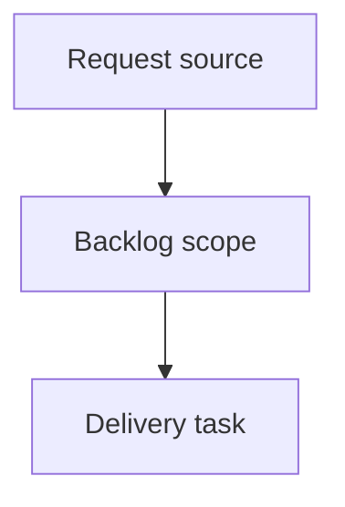

## item_001_phase_0_credibiliser_le_world_cup_predictor_donnees_reelles_garde_fou_backtest - Phase 0 - Credibiliser le World Cup Predictor (donnees reelles, garde-fou, backtest)
> From version: 1.0.0
> Schema version: 1.0
> Status: Done
> Understanding: 90%
> Confidence: 85%
> Progress: 100%
> Complexity: High
> Theme: Operator workflow and runtime integration
> Reminder: Update status/understanding/confidence/progress and linked request/task references when you edit this doc.

# Problem
Le predicteur tourne sur 12 matchs d'exemple (data/raw/international_results.csv identique a examples/), ce qui rend toute prediction non fiable mais presentee comme credible.
Aucune mesure de fiabilite n'existe (pas de backtest, pas de log-loss/Brier/accuracy, aucun test).
Phase 0 doit credibiliser le projet avant toute amelioration de modele : brancher les vraies donnees, empecher silencieusement de predire sur un dataset trop petit, et etablir une baseline chiffree de la precision actuelle.

# Scope
- In:
  - Procedure/script documente de chargement et refresh du dataset martj42 dans data/raw/.
  - Garde-fou taille minimale du dataset (seuil configurable) expose au CLI et au dashboard.
  - Module de backtest temporel : log-loss, Brier, accuracy vs baselines, artefact outputs/backtest_report.*.
  - Tests pytest pour le garde-fou et les metriques de backtest.
- Out:
  - Refonte du modele (Elo glissant, retrait de class_weight, calibration) -> Phase 1.
  - Dixon-Coles, simulation Monte-Carlo de tournoi -> Phases 2-3.

# Acceptance criteria
- AC1: Le dataset martj42 peut etre charge dans data/raw/international_results.csv via une procedure documentee, et le pipeline tourne dessus sans erreur.
- AC2: Sous un seuil configurable de matchs historiques, le CLI et le dashboard emettent un avertissement visible au lieu de predire silencieusement.
- AC3: Un backtest temporel reproductible produit log-loss, Brier, accuracy du modele et des baselines, ecrits dans outputs/backtest_report.*.
- AC4: Des tests pytest valident le garde-fou et le calcul des metriques de backtest.

# AC Traceability
- request-AC1 -> This backlog slice. Proof: AC1: Le dataset martj42 peut etre charge dans data/raw/international_results.csv via une procedure documentee, et le pipeline tourne dessus sans erreur.
- request-AC2 -> This backlog slice. Proof: AC2: Sous un seuil configurable de matchs historiques, le CLI et le dashboard emettent un avertissement visible au lieu de predire silencieusement.
- request-AC3 -> This backlog slice. Proof: AC3: Un backtest temporel reproductible produit log-loss, Brier, accuracy du modele et des baselines, ecrits dans outputs/backtest_report.*.
- request-AC4 -> This backlog slice. Proof: AC4: Des tests pytest valident le garde-fou et le calcul des metriques de backtest.

# Decision framing
- Product framing: Not needed
- Product signals: (none detected)
- Product follow-up: No product brief follow-up is expected based on current signals.
- Architecture framing: Not needed
- Architecture signals: (none detected)
- Architecture follow-up: No architecture decision follow-up is expected based on current signals.

# Links
- Product brief(s): (none yet)
- Architecture decision(s): (none yet)
- Request: `logics/request/req_000_phase_0_credibiliser_predictor.md`
- Primary task(s): (none yet)

# AI Context
- Summary: Phase 0 - Credibiliser le World Cup Predictor (donnees reelles, garde-fou, backtest)
- Keywords: backlog-groom, request, phase 0 - credibiliser le world cup predictor (donnees reelles, garde-fou, backtest), bounded slice
- Use when: Use when implementing or reviewing the delivery slice for Phase 0 - Credibiliser le World Cup Predictor (donnees reelles, garde-fou, backtest).
- Skip when: Skip when the change is unrelated to this delivery slice or its linked request.

# Priority
- Impact:
- Urgency:

# Notes
- Hybrid rationale: Derived from request `req_000_phase_0_credibiliser_predictor` and kept bounded to one coherent delivery slice.
- Source file: `logics/request/req_000_phase_0_credibiliser_predictor.md`.
- Generated locally by logics-manager.
- Task `task_001_phase_0_credibiliser_le_world_cup_predictor_donnees_reelles_garde_fou_backtest` was finished via `logics-manager flow finish task` on 2026-06-15.

# Tasks
- `task_001_phase_0_credibiliser_le_world_cup_predictor_donnees_reelles_garde_fou_backtest`
