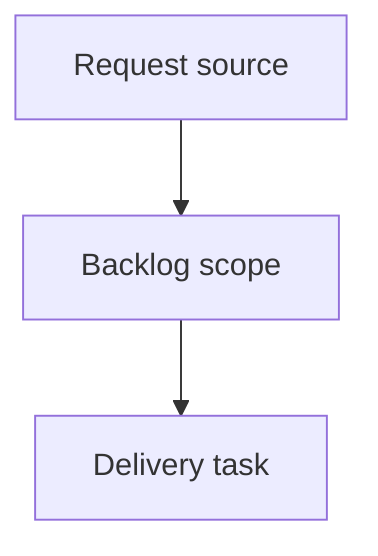

## item_002_phase_1_reparer_le_modele_vectorisation_elo_glissant_calibration_battre_la_base_rate - Phase 1 - Reparer le modele (vectorisation, Elo glissant, calibration, battre la base-rate)
> From version: 1.0.0
> Schema version: 1.0
> Status: Done
> Understanding: 90%
> Confidence: 85%
> Progress: 100%
> Complexity: High
> Theme: Operator workflow and runtime integration
> Reminder: Update status/understanding/confidence/progress and linked request/task references when you edit this doc.

# Problem
Le backtest Phase 0 sur donnees reelles (3600 train -> 400 test) prouve que le modele actuel DETRUIT de la valeur : accuracy 41.3% < base-rate 48.5%, log-loss 1.094 > base-rate 1.055, quasi identique au tirage uniforme.
Causes identifiees : (a) Elo/FIFA neutralises a l'entrainement (signal fort inutilise), (b) class_weight=balanced sur-predit les nuls, (c) pas de calibration, (d) build_match_features O(n^2) empeche tout backtest a grande echelle (534s pour 4000 matchs).
Phase 1 doit reparer le coeur du modele pour qu'il batte enfin la base-rate, mesure par backtest.

# Scope
- In:
  - Vectoriser build_match_features (rolling trie, sans groupby par match).
  - Elo glissant pre-match sans fuite, en feature elo_diff (entrainement + fixtures), Elo manuel prioritaire.
  - Retrait de class_weight=balanced + calibration robuste des probabilites.
  - Re-backtest documente vs base-rate + tests (fuite Elo, equivalence features).
- Out:
  - FIFA historique (fifa_*_diff restent neutres a l'entrainement).
  - Dixon-Coles / Poisson bivarie -> Phase 2.
  - Simulation Monte-Carlo de tournoi -> Phase 3.

# Acceptance criteria
- AC1: build_match_features est vectorise et produit des features equivalentes en O(n log n) ; un backtest sur >= 10000 matchs s'execute en un temps raisonnable (objectif < 60s).
- AC2: Un Elo glissant pre-match est calcule sans fuite et alimente elo_diff a l'entrainement (plus de neutralisation de l'Elo) comme pour les fixtures ; l'Elo manuel reste prioritaire s'il est fourni.
- AC3: class_weight=balanced est retire et les probabilites sont calibrees ; la chaine reste robuste sur petit echantillon (tests existants verts).
- AC4: Le backtest sur donnees reelles montre le modele au niveau ou au-dessus de la base-rate sur log-loss ET accuracy, chiffres consignes.
- AC5: La suite pytest existante reste verte et de nouveaux tests couvrent l'Elo glissant (absence de fuite) et la vectorisation (equivalence des features).

# AC Traceability
- request-AC1 -> This backlog slice. Proof: AC1: build_match_features est vectorise et produit des features equivalentes en O(n log n) ; un backtest sur >= 10000 matchs s'execute en un temps raisonnable (objectif < 60s).
- request-AC2 -> This backlog slice. Proof: AC2: Un Elo glissant pre-match est calcule sans fuite et alimente elo_diff a l'entrainement (plus de neutralisation de l'Elo) comme pour les fixtures ; l'Elo manuel reste prioritaire s'il est fourni.
- request-AC3 -> This backlog slice. Proof: AC3: class_weight=balanced est retire et les probabilites sont calibrees ; la chaine reste robuste sur petit echantillon (tests existants verts).
- request-AC4 -> This backlog slice. Proof: AC4: Le backtest sur donnees reelles montre le modele au niveau ou au-dessus de la base-rate sur log-loss ET accuracy, chiffres consignes.
- request-AC5 -> This backlog slice. Proof: AC5: La suite pytest existante reste verte et de nouveaux tests couvrent l'Elo glissant (absence de fuite) et la vectorisation (equivalence des features).

# Decision framing
- Product framing: Not needed
- Product signals: (none detected)
- Product follow-up: No product brief follow-up is expected based on current signals.
- Architecture framing: Not needed
- Architecture signals: (none detected)
- Architecture follow-up: No architecture decision follow-up is expected based on current signals.

# Links
- Product brief(s): (none yet)
- Architecture decision(s): (none yet)
- Request: `logics/request/req_001_phase_1_reparer_modele.md`
- Primary task(s): (none yet)

# AI Context
- Summary: Phase 1 - Reparer le modele (vectorisation, Elo glissant, calibration, battre la base-rate)
- Keywords: backlog-groom, request, phase 1 - reparer le modele (vectorisation, elo glissant, calibration, battre la base-rate), bounded slice
- Use when: Use when implementing or reviewing the delivery slice for Phase 1 - Reparer le modele (vectorisation, Elo glissant, calibration, battre la base-rate).
- Skip when: Skip when the change is unrelated to this delivery slice or its linked request.

# Priority
- Impact:
- Urgency:

# Notes
- Hybrid rationale: Derived from request `req_001_phase_1_reparer_modele` and kept bounded to one coherent delivery slice.
- Source file: `logics/request/req_001_phase_1_reparer_modele.md`.
- Generated locally by logics-manager.
- Task `task_002_phase_1_reparer_le_modele_vectorisation_elo_glissant_calibration_battre_la_base_rate` was finished via `logics-manager flow finish task` on 2026-06-15.

# Tasks
- `task_002_phase_1_reparer_le_modele_vectorisation_elo_glissant_calibration_battre_la_base_rate`
