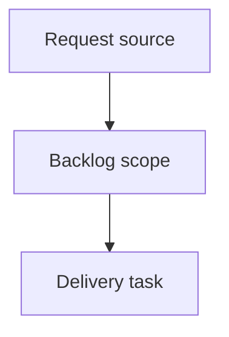

## item_003_phase_2_affiner_le_1x2_retrait_score_ponderation_temporelle_selection_modele_par_backtest - Phase 2 - Affiner le 1X2 (retrait score, ponderation temporelle, selection modele par backtest)
> From version: 1.0.0
> Schema version: 1.0
> Status: Done
> Understanding: 90%
> Confidence: 85%
> Progress: 100%
> Complexity: High
> Theme: Operator workflow and runtime integration
> Reminder: Update status/understanding/confidence/progress and linked request/task references when you edit this doc.

# Problem
L'utilisateur n'a besoin que du resultat (vainqueur ou nul, 1X2), pas du score exact. La colonne `most_likely_score` et le modele Poisson sont superflus et doivent etre retires.
Apres Phase 1 (baseline mesuree : log-loss 0.865 / Brier 0.506 / accuracy 60.9% vs base-rate 1.046 / 48.6%), il faut affiner la PRECISION du classifieur 1X2, pas predire des scores.
Les choix (ponderation temporelle, type de modele, hyperparametres Elo) doivent etre pilotes objectivement par le backtest, pas a l'intuition.

# Scope
- In:
  - Retrait de `most_likely_score` (CSV, Markdown, dashboard) + suppression du code Poisson inutilise.
  - Ponderation temporelle (time-decay) parametrable des matchs d'entrainement.
  - Selection pilotee par backtest : modele (logistique calibree vs gradient boosting) + hyperparametres Elo.
  - Re-backtest + consignation du gain vs baseline Phase 1.
- Out:
  - Modelisation de score / Dixon-Coles (besoin 1X2 uniquement).
  - Simulation Monte-Carlo de tournoi -> Phase 3.
  - FIFA historique (indisponible).

# Acceptance criteria
- AC1: `most_likely_score` est absent des sorties (CSV, Markdown, dashboard) et le code Poisson inutilise est supprime ; le pipeline 1X2 reste fonctionnel.
- AC2: Une ponderation temporelle parametrable des echantillons d'entrainement est implementee et appliquee a l'entrainement.
- AC3: Le choix du modele et des hyperparametres Elo est determine par le backtest (procedure reproductible), et la meilleure configuration est retenue.
- AC4: Le backtest sur donnees reelles montre la configuration retenue au niveau ou au-dessus de la baseline Phase 1 (log-loss <= 0.865 et accuracy >= 60.9% sur un test comparable), chiffres consignes ; toute non-amelioration est documentee honnetement.
- AC5: La suite pytest reste verte (tests impactes par le retrait de la colonne mis a jour) avec, le cas echeant, de nouveaux tests (time-decay).

# AC Traceability
- request-AC1 -> This backlog slice. Proof: AC1: `most_likely_score` est absent des sorties (CSV, Markdown, dashboard) et le code Poisson inutilise est supprime ; le pipeline 1X2 reste fonctionnel.
- request-AC2 -> This backlog slice. Proof: AC2: Une ponderation temporelle parametrable des echantillons d'entrainement est implementee et appliquee a l'entrainement.
- request-AC3 -> This backlog slice. Proof: AC3: Le choix du modele et des hyperparametres Elo est determine par le backtest (procedure reproductible), et la meilleure configuration est retenue.
- request-AC4 -> This backlog slice. Proof: AC4: Le backtest sur donnees reelles montre la configuration retenue au niveau ou au-dessus de la baseline Phase 1 (log-loss <= 0.865 et accuracy >= 60.9% sur un test comparable), chiffres consignes ; toute non-amelioration est documentee honnetement.
- request-AC5 -> This backlog slice. Proof: AC5: La suite pytest reste verte (tests impactes par le retrait de la colonne mis a jour) avec, le cas echeant, de nouveaux tests (time-decay).

# Decision framing
- Product framing: Not needed
- Product signals: (none detected)
- Product follow-up: No product brief follow-up is expected based on current signals.
- Architecture framing: Not needed
- Architecture signals: (none detected)
- Architecture follow-up: No architecture decision follow-up is expected based on current signals.

# Links
- Product brief(s): (none yet)
- Architecture decision(s): (none yet)
- Request: `logics/request/req_002_phase_2_affiner_1x2.md`
- Primary task(s): (none yet)

# AI Context
- Summary: Phase 2 - Affiner le 1X2 (retrait score, ponderation temporelle, selection modele par backtest)
- Keywords: backlog-groom, request, phase 2 - affiner le 1x2 (retrait score, ponderation temporelle, selection modele par backtest), bounded slice
- Use when: Use when implementing or reviewing the delivery slice for Phase 2 - Affiner le 1X2 (retrait score, ponderation temporelle, selection modele par backtest).
- Skip when: Skip when the change is unrelated to this delivery slice or its linked request.

# Priority
- Impact:
- Urgency:

# Notes
- Hybrid rationale: Derived from request `req_002_phase_2_affiner_1x2` and kept bounded to one coherent delivery slice.
- Source file: `logics/request/req_002_phase_2_affiner_1x2.md`.
- Generated locally by logics-manager.
- Task `task_003_phase_2_affiner_le_1x2_retrait_score_ponderation_temporelle_selection_modele_par_backtest` was finished via `logics-manager flow finish task` on 2026-06-15.

# Tasks
- `task_003_phase_2_affiner_le_1x2_retrait_score_ponderation_temporelle_selection_modele_par_backtest`
