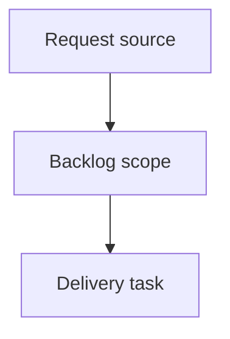

## item_004_phase_3_optimiser_la_precision_1x2_par_validation_robuste_donnees_historiques_enrichies_et_tuning_marche - Phase 3 - Optimiser la precision 1X2 par validation robuste, donnees historiques enrichies et tuning marche
> From version: 1.0.0
> Schema version: 1.0
> Status: Done
> Understanding: 95%
> Confidence: 80%
> Progress: 100%
> Complexity: High
> Theme: Model quality
> Reminder: Update status/understanding/confidence/progress and linked request/task references when you edit this doc.

# Problem
Le modele 1X2 actuel est credible et bat la base-rate, mais la precision peut encore etre optimisee de facon mesurable.
La prochaine phase doit ameliorer la qualite probabiliste des predictions, en priorite le log-loss et le Brier, sans sacrifier l'accuracy.
Les gains doivent etre demontres par validation temporelle robuste, pas par une seule fenetre de test ou par intuition. Note: la baseline Phase 2 (0.8448) est une mesure mono-fenetre ET pre-blend marche; elle devra etre re-mesuree sous le protocole walk-forward avant toute comparaison.
Le pipeline doit lever une incoherence train/serve verifiee: `fifa_rank_diff`, `fifa_points_diff` et `market_*` sont constants a l'entrainement (le modele HGB ne split jamais dessus, sortie invariante) mais renseignes au moment fixture. Ce sont des colonnes mortes/trompeuses cote modele, pas une corruption de prediction; le marche reel n'agit que via `blend_with_market`. A historiser sans fuite ou retirer de `FEATURE_COLUMNS`.
Le besoin utilisateur reste le resultat 1X2 pour un jeu de pronostics prive; la prediction de score exact et la simulation complete de tournoi ne sont pas l'objectif de cette phase.

# Scope
- In:
  - Construire une validation walk-forward multi-fenetres pour remplacer la selection sur une seule fenetre recente.
  - Ajouter un reporting segmente pour comprendre ou le modele gagne/perd: competitions majeures, qualifications, amicaux, terrain neutre, favoris/outsiders, matchs equilibres.
  - Resoudre les colonnes FIFA/marche mortes: historique date-par-date sans fuite si disponible, sinon retrait de `FEATURE_COLUMNS`, avec test d'invariance/absence. Rendre le backtest representatif (chemin blende) ou documenter que la baseline reste pre-blend.
  - Tuner le blending marche (`market_weight`) UNIQUEMENT si un historique de cotes sans fuite existe; comparer `model-only`, `market-only`, `base-rate`, `uniform`, et une grille de poids. Sinon documenter l'indisponibilite et garder `model-only`.
  - Ajouter/experimenter des features dediees aux nuls et matchs equilibres.
  - Ajouter/experimenter des features de contexte Coupe du Monde quand les donnees sont disponibles.
  - Ajouter/experimenter des variantes Elo mesurees.
  - Documenter les resultats, les non-gains, et ne cabler en production que les changements robustement meilleurs que la baseline Phase 2.
- Out:
  - Prediction de score exact, Poisson ou Dixon-Coles.
  - Simulation de tournoi complet.
  - Dashboard/UI hors restitution des rapports produits.
  - Scraping de sources non autorisees ou integration de donnees sans droit d'usage clair.
  - Retention d'une feature ou d'un modele sans preuve backtest robuste.

# Acceptance criteria
- AC1: Un backtest walk-forward multi-fenetres est disponible, reproductible depuis la CLI ou un script, et produit log-loss, Brier, accuracy, moyenne, ecart-type et classement des strategies.
- AC2: Le reporting inclut des segments utiles a la decision: type de competition, terrain neutre/non-neutre, niveau d'equilibre Elo, favoris/outsiders, et competitions majeures si le dataset les permet.
- AC3: Les colonnes FIFA/marche ne sont plus des entrees mortes ni trompeuses cote modele. Resolution: soit historique date-par-date sans fuite (signal en entrainement ET prediction), soit retrait de `FEATURE_COLUMNS` (marche garde uniquement via `blend_with_market`). Un test verrouille le choix: tant qu'elles ne sont pas historisees, il prouve l'invariance des predictions du modele de prod a ces colonnes, ou leur absence de `FEATURE_COLUMNS`.
- AC4: La politique de blend marche est decidee par validation, pas heritee. SI un historique de cotes sans fuite est disponible: `market_weight` est selectionne par walk-forward en comparant `model-only`, `market-only`, `base-rate`, `uniform` et une grille, valeur retenue documentee avec metriques. SINON: l'indisponibilite est documentee, `model-only` reste la reference de validation, et il est trace que le `0.35` de prod est un choix non valide sur historique (a confirmer ou retirer).
- AC5: Des features dediees aux nuls/matchs equilibres sont ajoutees derriere une ablation walk-forward; retention en prod uniquement si log-loss ET Brier moyens s'ameliorent sans baisse d'accuracy > 0.5 point; sinon documentees et non cablees.
- AC6: Les features de contexte Coupe du Monde et les variantes Elo sont soit experimentees avec resultats/non-gains consignes, soit explicitement reportees a un item de suivi avec justification (donnees indisponibles ou hors budget de la slice). Aucune n'est cablee en prod sans gain walk-forward demontre.
- AC7: La config de prod n'est modifiee que si la config candidate bat la config Phase 2 RE-MESUREE sous le MEME protocole walk-forward (la cible mono-fenetre 0.8448/0.4958 n'est pas comparable a une moyenne multi-fenetres). Critere testable: amelioration de la moyenne walk-forward du log-loss ET du Brier, et accuracy qui ne baisse pas de plus de 0.5 point; sinon la config Phase 2 reste la reference.
- AC8: La suite de tests reste verte et couvre: l'invariance/retrait FIFA-marche (AC3), la politique de blend marche (AC4), et les nouveaux rapports walk-forward/segments.

# Delivery slices
- Slice 1 - Evaluation robuste:
  - Ajouter un module/script de validation walk-forward.
  - Produire un rapport agregat avec moyenne, ecart-type et classement des strategies.
  - Ajouter les segments minimaux: `competition_type`, `neutral`, `elo_balance_bucket`, `favorite_bucket`.
- Slice 2 - Colonnes FIFA/marche mortes:
  - Verifier d'abord l'invariance: prouver par test que les predictions du modele de prod ne changent pas quand on fait varier `fifa_rank_diff`/`fifa_points_diff`/`market_*` (elles sont constantes en entrainement).
  - Decider: retirer ces colonnes de `FEATURE_COLUMNS` (le marche reste gere par `blend_with_market`), OU les historiser date-par-date sans fuite si la donnee existe.
  - Ajouter le test de non-regression qui verrouille le choix retenu (invariance prouvee tant que non historise, ou absence de la colonne).
- Slice 3 - Politique marche (data-gated):
  - PREREQUIS: disposer d'un historique de cotes sans fuite. Sans lui, cette slice se reduit a documenter l'indisponibilite et conserver `model-only` (le `0.35` de prod reste non valide sur historique).
  - Si dispo: ajouter la baseline `market-only`, balayer `market_weight`, retenir la valeur par log-loss/Brier walk-forward sur le chemin blende.
- Slice 4 - Features nuls/equilibre:
  - Ajouter `abs_elo_diff`, `abs_recent_form_5_diff`, `abs_recent_form_10_diff`, draw-rate recent par equipe, draw-rate combine, force offensive/defensive combinee.
  - Valider l'effet par ablation walk-forward: Phase 2 re-mesuree vs nouvelles features.
- Slice 5 - Contexte Coupe du Monde et Elo: SORTIE de cet item.
  - Ces workstreams de recherche (contexte WC + variantes Elo) sont desormais portes par l'item de suivi `item_005_phase_3b_contexte_coupe_du_monde_et_variantes_elo_suivi_de_phase_3`, pour garder cet item borne et Phase 3 livrable sur Slices 1-4.
  - AC6 de la requete est trace par `item_005` (voir AC Traceability ci-dessous).

# Implementation notes
- Le log-loss et le Brier sont les metriques primaires; l'accuracy reste une garde contre une degradation visible du pick final.
- Le backtest actuel (`run_backtest`) n'applique PAS `blend_with_market` et neutralise les features marche: il mesure le modele pre-blend. Le walk-forward doit, a minima, expliciter ce point; idealement evaluer aussi le chemin blende (necessite un historique de cotes).
- Le tuning `market_weight` (AC4) est infaisable sans historique de cotes sans fuite: martj42 n'en contient pas, `bookmaker_odds.csv` ne couvre que les fixtures. Ne pas simuler/inventer de cotes.
- Les rapports doivent inclure `n` pour chaque segment; tout segment faible echantillon doit etre marque indicatif.
- Les nouvelles features doivent etre calculees avec le meme principe anti-fuite que les stats glissantes existantes: un match ne voit que le passe.
- La production doit rester simple: si une experience ne gagne pas clairement, elle reste documentee mais non cablee par defaut.
- Les sorties experimentales peuvent aller dans `outputs/` sous des noms explicites (`walk_forward_report.*`, `segment_report.*`, `market_weight_selection.*`).

# AC Traceability
- request-AC1 -> This backlog slice. Proof: AC1: Un backtest walk-forward multi-fenetres est disponible, reproductible depuis la CLI ou un script, et produit log-loss, Brier, accuracy, moyenne, ecart-type et classement des strategies.
- request-AC2 -> This backlog slice. Proof: AC2: Le reporting inclut des segments utiles a la decision: type de competition, terrain neutre/non-neutre, niveau d'equilibre Elo, favoris/outsiders, et competitions majeures si le dataset les permet.
- request-AC3 -> Slice 2. Proof: test d'invariance/retrait des colonnes FIFA-marche mortes; politique historisation-ou-retrait documentee.
- request-AC4 -> Slice 3 (data-gated). Proof: selection `market_weight` par walk-forward SI historique de cotes dispo, sinon indisponibilite documentee + `model-only` conserve.
- request-AC5 -> Slice 4. Proof: ablation walk-forward des features nuls/equilibre; retention seulement si log-loss ET Brier s'ameliorent sans baisse d'accuracy > 0.5 pt.
- request-AC6 -> Deleguee a `item_005_phase_3b_contexte_coupe_du_monde_et_variantes_elo_suivi_de_phase_3`. Proof: contexte WC + variantes Elo portes par l'item de suivi.
- request-AC7 -> Slices 1 & 4. Proof: baseline Phase 2 RE-MESUREE en walk-forward; prod modifiee seulement si moyenne log-loss ET Brier s'ameliorent, accuracy non baissee > 0.5 pt.
- request-AC8 -> All slices. Proof: pytest vert couvrant invariance/retrait FIFA-marche, politique marche, rapports walk-forward/segments.

# Decision framing
- Product framing: Not needed
- Product signals: (none detected)
- Product follow-up: No product brief follow-up is expected based on current signals.
- Architecture framing: Not needed
- Architecture signals: (none detected)
- Architecture follow-up: No architecture decision follow-up is expected based on current signals.

# Validation plan
- `rtk .venv/bin/python -m pytest -q` ou equivalent apres installation des dependances.
- Backtest walk-forward sur dataset complet quand `data/raw/international_results.csv` est disponible.
- Rapport de comparaison Phase 2 vs nouvelle config retenue.
- Verification explicite qu'aucune feature FIFA/marche future-only n'est incluse en entrainement sans historique.
- `rtk logics-manager lint --require-status`.
- `rtk logics-manager audit`.

# Links
- Product brief(s): (none yet)
- Architecture decision(s): (none yet)
- Request: `logics/request/req_003_phase_3_optimiser_precision_1x2.md`
- Primary task(s): (none yet)

# AI Context
- Summary: Phase 3 - Optimiser la precision 1X2 par validation robuste, donnees historiques enrichies et tuning marche
- Keywords: backlog-groom, request, phase 3 - optimiser la precision 1x2 par validation robuste, donnees historiques enrichies et tuning marche, bounded slice
- Use when: Use when implementing or reviewing the delivery slice for Phase 3 - Optimiser la precision 1X2 par validation robuste, donnees historiques enrichies et tuning marche.
- Skip when: Skip when the change is unrelated to this delivery slice or its linked request.

# Priority
- Impact: High - vise directement la precision probabiliste du predictor 1X2, le coeur du produit.
- Urgency: Medium - important avant d'utiliser les predictions pour des pronostics reels, mais depend de donnees completes et potentiellement externes.

# Notes
- Hybrid rationale: Derived from request `req_003_phase_3_optimiser_precision_1x2`.
- Perimetre (review): ce backlog couvrait 5 workstreams heterogenes. Slice 5 (contexte WC + variantes Elo) a ete sortie dans `item_005_phase_3b_contexte_coupe_du_monde_et_variantes_elo_suivi_de_phase_3` pour borner cet item. Phase 3 est livrable sur Slices 1-4 ici. Slice 3 reste data-gated par l'historique de cotes.
- Source file: `logics/request/req_003_phase_3_optimiser_precision_1x2.md`.
- Generated locally by logics-manager.
- Task `task_004_phase_3_optimiser_la_precision_1x2_par_validation_robuste_donnees_historiques_enrichies_et_tuning_marche` was finished via `logics-manager flow finish task` on 2026-06-18.

# Tasks
- `task_004_phase_3_optimiser_la_precision_1x2_par_validation_robuste_donnees_historiques_enrichies_et_tuning_marche`
