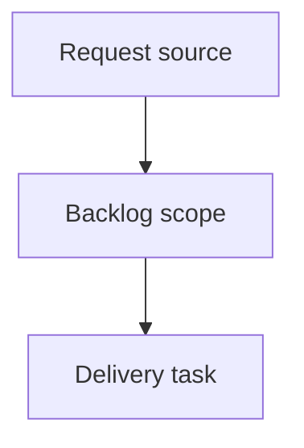

## item_005_phase_3b_contexte_coupe_du_monde_et_variantes_elo_suivi_de_phase_3 - Phase 3b - Contexte Coupe du Monde et variantes Elo (suivi de Phase 3)
> From version: 1.0.0
> Schema version: 1.0
> Status: Draft
> Understanding: 70%
> Confidence: 55%
> Progress: 0%
> Complexity: High
> Theme: Model quality
> Reminder: Update status/understanding/confidence/progress and linked request/task references when you edit this doc.

# Problem
Cet item porte la part de recherche differable de Phase 3, sortie de `item_004` (ex-Slice 5) pour garder Phase 3 livrable sur ses slices coeur (validation walk-forward, nettoyage features mortes, features nuls/equilibre).
Deux workstreams heterogenes et data-gated y sont regroupes:
- Contexte specifique Coupe du Monde non modelise: pays hote, avantage regional/confederation, phase de tournoi, jours de repos, deplacement/distance.
- Variantes Elo plus riches que l'Elo actuel (K fixe, avantage terrain fixe): K par importance, regression vers la moyenne pour equipes inactives, Elo attaque/defense, initialisation par ranking historique.
Aucune n'est cablee en production sans gain demontre sur la validation walk-forward livree par Phase 3 (`item_004`).

# Scope
- In:
  - Experimenter des features de contexte Coupe du Monde, uniquement quand les donnees existent sans fuite: hote, avantage regional/confederation, phase de tournoi, jours de repos, travel/distance approximative.
  - Experimenter des variantes Elo mesurees: K par importance, regression d'inactivite, Elo attaque/defense, initialisation par ranking historique si disponible.
  - Reutiliser le harness walk-forward et le reporting segmente livres par `item_004` (pas de nouvelle infra de validation).
  - Documenter les variantes retenues ET les non-gains.
- Out:
  - Toute l'infra de validation/segmentation/marche/features-nuls (livree par `item_004`).
  - Prediction de score exact, Poisson, Dixon-Coles, simulation de tournoi.
  - Scraping de sources non autorisees ou donnees sans droit d'usage clair.
  - Retention d'une feature/variante sans preuve walk-forward robuste.

# Acceptance criteria
- AC1: Les features de contexte Coupe du Monde sont experimentees uniquement sur donnees disponibles sans fuite, avec resultats walk-forward consignes; aucune n'est cablee sans gain log-loss ET Brier sans baisse d'accuracy > 0.5 point. Toute feature non realisable faute de donnees est consignee comme non-faite avec raison.
- AC2: Au moins une variante Elo (parmi K par importance, regression d'inactivite, Elo attaque/defense, init ranking) est evaluee par walk-forward contre l'Elo de prod; gains et non-gains consignes; retention en prod uniquement si gain robuste.
- AC3: La validation reutilise le harness walk-forward et les segments de `item_004`; aucune nouvelle infra de validation n'est introduite.
- AC4: La config de prod (`config.py`, `elo.py`, `features.py`) n'est modifiee que pour les variantes battant la baseline Phase 2/3 re-mesuree sous le meme protocole walk-forward; sinon documentees et non cablees.
- AC5: La suite de tests reste verte et couvre l'anti-fuite des nouvelles features de contexte/Elo retenues.

# Delivery slices
- Slice 1 - Contexte Coupe du Monde:
  - Identifier les donnees disponibles sans fuite (hote, confederation, phase, repos, distance) et exclure ce qui n'est pas sourcable proprement.
  - Construire les colonnes leak-free, ablation walk-forward, retention au seuil.
- Slice 2 - Variantes Elo:
  - Implementer les variantes derriere des parametres/flags, sans casser l'Elo de prod par defaut.
  - Comparer chaque variante a l'Elo de prod par walk-forward; retenir seulement les gains robustes.

# Implementation notes
- Pre-requis dur: Phase 3 (`item_004`) doit avoir livre le harness walk-forward, le reporting segmente et la baseline re-mesuree. Sans ca, cet item ne peut pas mesurer ses gains.
- Les segments Coupe du Monde ont peu d'echantillons: afficher `n` et traiter les chiffres comme indicatifs quand `n` est faible.
- Multiplier features/variantes surajuste: la retention est pilotee par walk-forward et metriques probabilistes, pas par intuition.
- Garder l'Elo de prod comme defaut; les variantes sont opt-in tant qu'elles ne gagnent pas.

# AC Traceability
- request-AC6 -> This backlog item. Proof: experiences contexte Coupe du Monde et variantes Elo, ou consignation explicite de non-faisabilite (AC6 de req_003 autorise le report vers un item de suivi).
- request-AC7 -> This backlog item. Proof: config prod modifiee seulement si gain walk-forward robuste vs baseline Phase 2/3 re-mesuree.
- request-AC8 -> This backlog item. Proof: tests verts couvrant l'anti-fuite des features contexte/Elo retenues.

# Decision framing
- Product framing: Not needed
- Product signals: (none detected)
- Product follow-up: No product brief follow-up is expected based on current signals.
- Architecture framing: Not needed
- Architecture signals: (none detected)
- Architecture follow-up: No architecture decision follow-up is expected based on current signals.

# Validation plan
- Reutiliser `scripts/walk_forward_validation.py` (livre par `item_004`) pour mesurer chaque experience.
- Ablation: baseline Phase 2/3 re-mesuree vs candidate, sur le meme protocole walk-forward.
- `rtk .venv/bin/python -m pytest -q`.
- `rtk logics-manager lint --require-status`.
- `rtk logics-manager audit`.

# Links
- Product brief(s): (none yet)
- Architecture decision(s): (none yet)
- Request: `logics/request/req_003_phase_3_optimiser_precision_1x2.md`
- Primary task(s): (none yet)

# AI Context
- Summary: Suivi differable de Phase 3 - contexte Coupe du Monde et variantes Elo, mesures via le harness walk-forward livre par item_004.
- Keywords: backlog, follow-up, world-cup-context, elo-variants, walk-forward, deferred, phase-3b
- Use when: Apres livraison de Phase 3 (item_004), pour experimenter le contexte Coupe du Monde et des variantes Elo.
- Skip when: Phase 3 (item_004) n'est pas livree, ou la tache concerne l'infra de validation/marche/features-nuls.

# Priority
- Impact: Medium - gains potentiels de precision mais incertains et data-gated; le coeur de la precision Phase 3 est porte par `item_004`.
- Urgency: Low - differable; depend de Phase 3 livree et de la disponibilite de donnees de contexte.

# Notes
- Origine (review): carve-out de `item_004` (ex-Slice 5) pour respecter le principe "une slice bornee". Phase 3 reste livrable sur `item_004` Slices 1-4 sans bloquer sur cette recherche.
- Statut Draft: a groomer (preciser donnees disponibles, faisabilite des features de contexte) avant promotion en task.
- Generated locally by logics-manager.
- Reouvert apres auto-fermeture erronee par `flow finish task_004` (un backlog sans task est traite comme "toutes tasks done"): cet item est du travail differable a groomer, pas une livraison terminee. Ne pas re-finir tant qu'il n'a pas sa propre task.
