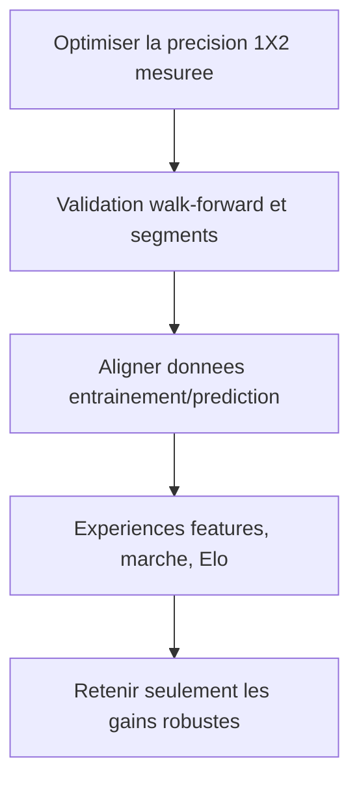

## req_003_phase_3_optimiser_precision_1x2 - Phase 3 - Optimiser la precision 1X2 par validation robuste, donnees historiques enrichies et tuning marche
> From version: 1.0.0
> Schema version: 1.0
> Status: Draft
> Understanding: 95%
> Confidence: 80%
> Complexity: High
> Theme: Model quality
> Reminder: Update status/understanding/confidence and linked backlog/task references when you edit this doc.

# Needs
- Le modele 1X2 actuel est credible et bat la base-rate, mais la precision peut encore etre optimisee de facon mesurable.
- La prochaine phase doit ameliorer la qualite probabiliste des predictions, en priorite le log-loss et le Brier, sans sacrifier l'accuracy.
- Les gains doivent etre demontres par validation temporelle robuste, pas par une seule fenetre de test ou par intuition.
- Le pipeline doit lever une incoherence train/serve verifiee dans le code: `fifa_rank_diff`, `fifa_points_diff` et `market_*` sont constants a l'entrainement (le modele HGB ne split jamais sur une colonne constante, donc sa sortie y est invariante), mais des valeurs reelles leur sont injectees au moment des fixtures. Ces colonnes sont aujourd'hui des entrees mortes/trompeuses cote modele; le seul effet marche reel vient du post-traitement `blend_with_market`, separe du modele.
- Le besoin utilisateur reste le resultat 1X2 pour un jeu de pronostics prive; la prediction de score exact et la simulation complete de tournoi ne sont pas l'objectif de cette phase.

# Context
- Phase 1 a repare les fondations: features vectorisees, Elo glissant pre-match sans fuite, calibration et backtest contre base-rate.
- Phase 2 a retire le score exact, ajoute la ponderation temporelle et selectionne `HistGradientBoostingClassifier` avec `ELO_K=30`, `ELO_HOME_ADVANTAGE=80`, `HALF_LIFE_YEARS=12.0`.
- Baseline Phase 2 documentee: modele HGB environ log-loss 0.8448, Brier 0.4958, accuracy 61.5% sur 1 000 matchs recents, vs base-rate 1.0462 / 0.6303 / 48.6% (source: `README.md` et `task_003`).
- ATTENTION sur cette baseline: c'est le modele AVANT blend marche. `run_backtest` n'appelle jamais `blend_with_market` et neutralise les features marche; la prod (`cli.py`, `web_server.py`) blende 35% de cotes quand elles existent. La baseline citee ne represente donc pas le pipeline live avec cotes, et une mesure mono-fenetre n'est pas comparable a une moyenne walk-forward.
- Limites observees:
  - `scripts/model_selection.py` teste peu de familles de modeles (logistic, hgb) et une seule fenetre temporelle (`temporal_split` une fois, `max_test=1000`) - pas de walk-forward.
  - `fifa_rank_diff`, `fifa_points_diff` et `market_*` sont constants en entrainement (`build_features_for_results`): le modele HGB ne split jamais dessus et sa sortie y est invariante. `build_fixture_features` y injecte des valeurs reelles au moment fixture -> colonnes mortes/trompeuses cote modele, pas une corruption de prediction. Le marche n'agit reellement que via `blend_with_market` (35%), hors du modele.
  - `market_weight` est fixe a 0.35 et n'a jamais ete valide sur historique: le backtest ne voit pas les cotes, aucun blend n'y est applique.
  - Le modele traite les nuls seulement comme une classe 1X2, sans features dediees aux matchs equilibres.
  - Le contexte specifique Coupe du Monde reste grossier: neutralite, avantage hote/regional, phase du tournoi, repos et deplacement ne sont pas modelises.
  - L'Elo est robuste mais simple: K fixe, avantage terrain fixe, pas de regression d'inactivite ni d'Elo attaque/defense.

# Scope (in / out)
- In:
  - Ajouter une validation walk-forward multi-fenetres, avec reporting moyenne/ecart-type et comparaison systematique aux baselines.
  - Ajouter des backtests segmentes: competition majeure, qualifications, amicaux, terrain neutre, matchs desequilibres/equilibres, favoris/outsiders, et si disponible Coupe du Monde uniquement.
  - Resoudre les colonnes FIFA/marche mortes: soit importer un historique date-par-date sans fuite pour qu'elles portent du signal en entrainement, soit les retirer de `FEATURE_COLUMNS` (le marche restant gere uniquement par `blend_with_market`). Verrouiller le choix par un test (invariance prouvee ou colonne absente).
  - Rendre le backtest representatif de la prod: pouvoir evaluer aussi le chemin blende (necessite un historique de cotes), sinon documenter explicitement que la baseline reste pre-blend.
  - Tuner `market_weight` par backtest si et seulement si un historique de cotes sans fuite existe, ajouter une baseline `market-only`, et retenir une politique documentee par log-loss/Brier; sinon documenter l'indisponibilite et conserver `model-only`.
  - Ajouter des features dediees aux nuls et aux matchs equilibres: `abs_elo_diff`, `abs_recent_form_5_diff`, `abs_recent_form_10_diff`, draw-rate recent par equipe, draw-rate combine, moyenne defensive/offensive combinee, indicateurs d'equilibre.
  - Ajouter des features de contexte Coupe du Monde quand les donnees sont disponibles: pays hote, avantage regional/confederation, phase de tournoi, jours de repos, travel/distance approximative.
  - Experimenter des variantes Elo mesurees: K par importance, regression vers la moyenne pour equipes inactives, Elo attaque/defense, initialisation par ranking historique si disponible.
  - Documenter les resultats et ne retenir en production que les changements qui ameliorent les metriques sur validation robuste.
- Out:
  - Prediction de score exact, Dixon-Coles ou Poisson.
  - Simulation Monte-Carlo de tournoi complet.
  - Scraping de sources non autorisees ou utilisation de donnees sans licence claire.
  - Ajout de complexite modele non mesuree ou retention d'un changement qui degrade le backtest robuste.

# Acceptance criteria
- AC1: Un backtest walk-forward multi-fenetres est disponible, reproductible depuis la CLI ou un script, et produit log-loss, Brier, accuracy, moyenne, ecart-type et classement des strategies.
- AC2: Le reporting inclut des segments utiles a la decision: type de competition, terrain neutre/non-neutre, niveau d'equilibre Elo, favoris/outsiders, et competitions majeures si le dataset les permet.
- AC3: Les colonnes FIFA/marche ne sont plus des entrees mortes ni trompeuses cote modele. Resolution: soit historique date-par-date sans fuite (signal en entrainement ET prediction), soit retrait de `FEATURE_COLUMNS` (marche garde uniquement via `blend_with_market`). Un test verrouille le choix: tant qu'elles ne sont pas historisees, il prouve l'invariance des predictions du modele de prod a ces colonnes, ou leur absence de `FEATURE_COLUMNS`.
- AC4: La politique de blend marche est decidee par validation, pas heritee. SI un historique de cotes sans fuite est disponible: `market_weight` est selectionne par walk-forward en comparant `model-only`, `market-only`, `base-rate`, `uniform` et une grille, valeur retenue documentee avec metriques. SINON: l'indisponibilite est documentee, `model-only` reste la reference de validation, et il est trace que le `0.35` de prod est un choix non valide sur historique (a confirmer ou retirer).
- AC5: Des features dediees aux nuls/matchs equilibres sont ajoutees derriere une ablation walk-forward; retention en prod uniquement si log-loss ET Brier moyens s'ameliorent sans baisse d'accuracy > 0.5 point; sinon documentees et non cablees.
- AC6: Les features de contexte Coupe du Monde et les variantes Elo sont soit experimentees avec resultats/non-gains consignes, soit explicitement reportees a un item de suivi avec justification (donnees indisponibles ou hors budget de la slice). Aucune n'est cablee en prod sans gain walk-forward demontre.
- AC7: La config de prod n'est modifiee que si la config candidate bat la config Phase 2 RE-MESUREE sous le MEME protocole walk-forward (la cible mono-fenetre 0.8448/0.4958 n'est pas comparable a une moyenne multi-fenetres). Critere testable: amelioration de la moyenne walk-forward du log-loss ET du Brier, et accuracy qui ne baisse pas de plus de 0.5 point; sinon la config Phase 2 reste la reference.
- AC8: La suite de tests reste verte et couvre: l'invariance/retrait FIFA-marche (AC3), la politique de blend marche (AC4), et les nouveaux rapports walk-forward/segments.

# Definition of Ready (DoR)
- [x] Problem statement is explicit and user impact is clear.
- [x] Scope boundaries (in/out) are explicit.
- [x] Acceptance criteria are testable.
- [x] Dependencies and known risks are listed.

# Dependencies & risks
- Depend de Phase 2 terminee (`req_002`) et de son pipeline 1X2 calibre.
- Depend du dataset complet `martj42/international_results` pour les backtests significatifs.
- Depend de la disponibilite/licence de donnees FIFA historiques et de cotes bookmaker historiques si ces signaux sont integres en entrainement. Le dataset martj42 ne contient AUCUNE cote; le format `bookmaker_odds.csv` actuel ne couvre que les fixtures a venir.
- Risque (bloquant AC4): sans historique de cotes sans fuite, le tuning `market_weight` par backtest est infaisable. Le bon resultat est alors de documenter l'indisponibilite et de conserver `model-only`, pas de cabler une valeur non validee.
- Risque (AC3): la "correction" attendue est surtout un nettoyage de features mortes; il ne faut pas chasser une corruption de prediction inexistante. Verifier d'abord l'invariance du modele a ces colonnes.
- Risque (AC7): la baseline 0.8448 est une mesure mono-fenetre ET pre-blend. Toute comparaison "bat la baseline" exige de re-mesurer Phase 2 sous le meme protocole walk-forward (et meme chemin blend/non-blend).
- Risque: les donnees FIFA/marche historiques peuvent etre absentes ou trop couteuses; dans ce cas, le bon resultat est de documenter l'exclusion ou le post-traitement plutot que d'inventer un signal.
- Risque: une validation plus robuste peut montrer que certains gains Phase 2 etaient specifiques a une fenetre recente; il faut accepter de garder la configuration actuelle si aucune variante ne gagne franchement.
- Risque: multiplier les features peut surajuster. La retention doit etre pilotee par walk-forward, segments et metriques probabilistes.
- Risque: les segments Coupe du Monde ont peu d'echantillons; les chiffres segmentes doivent etre presentes comme indicatifs quand `n` est faible.

# Companion docs
- Product brief(s): (none yet)
- Architecture decision(s): (none yet)

# References
- `src/worldcup_predictor/features.py`
- `src/worldcup_predictor/model.py`
- `src/worldcup_predictor/backtest.py`
- `src/worldcup_predictor/elo.py`
- `src/worldcup_predictor/cli.py`
- `scripts/model_selection.py`
- `tests/test_backtest.py`
- `tests/test_features_vectorized.py`
- `tests/test_elo.py`

# AI Context
- Summary: Optimiser la precision du predictor 1X2 par validation walk-forward robuste, alignement des donnees entrainement/prediction, tuning du blending marche, features nuls/equilibre, contexte Coupe du Monde et variantes Elo mesurees.
- Keywords: 1x2, walk-forward, model-selection, calibration, bookmaker-odds, market-weight, fifa-history, draw-features, world-cup-context, elo-variants, backtest-segments
- Use when: Apres Phase 2, pour chercher des gains mesurables de precision probabiliste sans revenir a la prediction de score.
- Skip when: La tache concerne le dashboard, la simulation de tournoi, le score exact, ou une correction de bug hors modele.

# Backlog
- `item_004_phase_3_optimiser_la_precision_1x2_par_validation_robuste_donnees_historiques_enrichies_et_tuning_marche` (coeur: validation walk-forward, nettoyage features mortes, politique marche, features nuls/equilibre - AC1-AC5, AC7, AC8)
- `item_005_phase_3b_contexte_coupe_du_monde_et_variantes_elo_suivi_de_phase_3` (suivi differable: contexte Coupe du Monde + variantes Elo - AC6)
