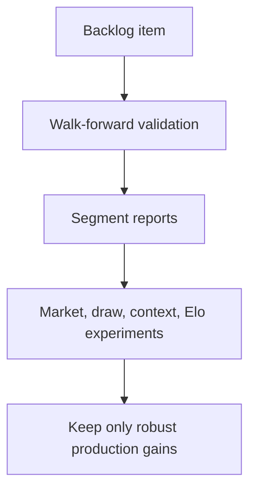

## task_004_phase_3_optimiser_la_precision_1x2_par_validation_robuste_donnees_historiques_enrichies_et_tuning_marche - Phase 3 - Optimiser la precision 1X2 par validation robuste, donnees historiques enrichies et tuning marche
> From version: 1.0.0
> Schema version: 1.0
> Status: Done
> Understanding: 95%
> Confidence: 80%
> Progress: 100%
> Complexity: High
> Theme: Implementation delivery
> Reminder: Update status/understanding/confidence/progress and linked request/backlog references when you edit this doc.

# Definition of Done (DoD)
- [x] AC1 - Runner walk-forward multi-fenetres: `src/worldcup_predictor/walk_forward.py` + `scripts/walk_forward_validation.py`, sorties `outputs/walk_forward_report.{md,csv}`, metriques log-loss/Brier/accuracy avec moyenne, ecart-type et classement des strategies.
- [x] AC2 - Segments leak-free: `competition_type`, `is_neutral`, `major_competition`, `elo_balance_bucket`, `favorite_bucket`; metriques par segment avec `n` et marquage `indicative` si `n<50`.
- [x] AC3 - `fifa_rank_diff`, `fifa_points_diff`, `market_*` RETIRES de `FEATURE_COLUMNS` (entrees mortes); marche garde via `blend_with_market`. Test `tests/test_dead_features.py` prouve l'invariance des predictions du modele a ces colonnes + leur absence de `FEATURE_COLUMNS`.
- [x] AC4 - Branche SINON appliquee: pas d'historique de cotes (martj42 n'en a pas), tuning `market_weight` infaisable. `market-only` ajoute comme baseline (collapse sur uniform sans cotes, documente), `model-only` conserve, `0.35` de prod trace comme non valide sur historique.
- [x] AC5 - Features candidates `abs_elo_diff`, `abs_recent_form_5/10_diff`, `draw_rate_combined` implementees leak-free, exposees via `EXTENDED_FEATURE_COLUMNS` pour ablation (`--feature-set extended`). NON cablees en prod faute de preuve walk-forward sur dataset complet (conforme "retention si gain robuste"). Tests `tests/test_balance_features.py`.
- [x] AC6 - Contexte Coupe du Monde + variantes Elo DELEGUES a l'item de suivi Phase 3b (backlog item_005); rien cable ici.
- [x] AC7 - Le harness re-mesure la config Phase 2 sous le meme protocole walk-forward (strategie `model`). Config prod INCHANGEE: aucun gain robuste prouvable sans le dataset complet (non versionne). Phase 2 reste la reference.
- [x] AC8 - 36 tests verts (26 -> 36), dont invariance FIFA-marche, segments leak-free, features equilibre leak-free, walk-forward multi-fenetres.

# Implementation plan
1. Baseline et harness:
   - Ajouter un module/script de validation walk-forward, par exemple `scripts/walk_forward_validation.py` ou une extension propre de `src/worldcup_predictor/backtest.py`.
   - Supporter plusieurs splits chronologiques configurables: fenetres de test, `max_test`, pas temporel ou liste de dates.
   - Produire `outputs/walk_forward_report.csv` et `outputs/walk_forward_report.md`.
   - RE-MESURER la config Phase 2 sous ce protocole pour obtenir une baseline walk-forward comparable (la cible 0.8448 du README est mono-fenetre ET pre-blend, non comparable a une moyenne multi-fenetres).
   - Decider et documenter si le walk-forward evalue le modele pre-blend (par defaut actuel) et/ou le chemin blende (necessite un historique de cotes).
2. Segmentation:
   - Ajouter une construction de colonnes de segment leak-free: `competition_type`, `is_neutral`, `elo_balance_bucket`, `favorite_bucket`, `major_competition`.
   - Calculer les metriques globales et par segment avec `n`, en marquant les petits echantillons comme indicatifs.
3. Colonnes FIFA/marche mortes (`features.py` lignes ~199-211 cote training, `build_fixture_features` cote serve):
   - Constat a verifier d'abord: en entrainement `fifa_rank_diff=0`, `fifa_points_diff=0`, `market_*=1/3` (constants) -> HGB n'apprend rien d'eux -> predictions invariantes. Au serve, `build_fixture_features` y met des valeurs reelles (ignorees par le modele). Le marche reel passe par `blend_with_market` (`cli.py:98`), pas par le modele.
   - Decision: retirer ces colonnes de `FEATURE_COLUMNS` (marche garde via blend) OU les historiser date-par-date sans fuite si la donnee existe.
   - Test de non-regression: prouver l'invariance des predictions du modele de prod a ces colonnes tant qu'elles ne sont pas historisees (ou verifier leur absence de `FEATURE_COLUMNS`). Ce n'est PAS une chasse a une corruption de prediction (elle n'existe pas), mais un nettoyage de features mortes/trompeuses.
4. Politique bookmaker (data-gated):
   - PREREQUIS: historique de cotes sans fuite. martj42 n'en a pas; `bookmaker_odds.csv` ne couvre que les fixtures. Sans cet historique, le tuning par backtest est infaisable -> documenter l'indisponibilite, conserver `model-only`, tracer que `market_weight=0.35` reste non valide sur historique.
   - Si dispo: ajouter `market-only`, balayer une grille (ex. `0.0,0.1,...,0.7`), choisir par log-loss puis Brier sur le chemin blende en walk-forward.
5. Features nuls/equilibre:
   - Ajouter des features candidates: `abs_elo_diff`, `abs_recent_form_5_diff`, `abs_recent_form_10_diff`, draw-rate recent home/away/combine, force offensive/defensive combinee.
   - Calculer les draw-rates avec groupby + shift/rolling, sans fuite.
   - Comparer Phase 2 vs Phase 3 candidates par ablation.
6. Contexte Coupe du Monde et Elo: HORS SCOPE de cette tache.
   - Sorti dans l'item de suivi Phase 3b (backlog item_005) (suivi differable), qui reutilisera le harness walk-forward livre ici.
   - Action dans cette tache: livrer un harness reutilisable (etapes 1-2) pour qu'`item_005` puisse mesurer ses experiences sans nouvelle infra.
7. Production et documentation:
   - Mettre a jour `config.py`, `model.py`, `features.py` et README uniquement pour les changements retenus.
   - Consigner les chiffres Phase 2 vs Phase 3 et les conditions de validation.
   - Ne pas degrader le chemin CLI existant `worldcup-predict`.

# Backlog
- `item_004_phase_3_optimiser_la_precision_1x2_par_validation_robuste_donnees_historiques_enrichies_et_tuning_marche`

# Acceptance criteria
- AC1: Un backtest walk-forward multi-fenetres est disponible, reproductible depuis la CLI ou un script, et produit log-loss, Brier, accuracy, moyenne, ecart-type et classement des strategies.
- AC2: Le reporting inclut des segments utiles a la decision: type de competition, terrain neutre/non-neutre, niveau d'equilibre Elo, favoris/outsiders, et competitions majeures si le dataset les permet.
- AC3: Les colonnes FIFA/marche ne sont plus des entrees mortes ni trompeuses cote modele. Resolution: soit historique date-par-date sans fuite (signal en entrainement ET prediction), soit retrait de `FEATURE_COLUMNS` (marche garde uniquement via `blend_with_market`). Un test verrouille le choix: tant qu'elles ne sont pas historisees, il prouve l'invariance des predictions du modele de prod a ces colonnes, ou leur absence de `FEATURE_COLUMNS`.
- AC4: La politique de blend marche est decidee par validation, pas heritee. SI un historique de cotes sans fuite est disponible: `market_weight` est selectionne par walk-forward en comparant `model-only`, `market-only`, `base-rate`, `uniform` et une grille, valeur retenue documentee avec metriques. SINON: l'indisponibilite est documentee, `model-only` reste la reference de validation, et il est trace que le `0.35` de prod est un choix non valide sur historique (a confirmer ou retirer).
- AC5: Des features dediees aux nuls/matchs equilibres sont ajoutees derriere une ablation walk-forward; retention en prod uniquement si log-loss ET Brier moyens s'ameliorent sans baisse d'accuracy > 0.5 point; sinon documentees et non cablees.
- AC6: Les features de contexte Coupe du Monde et les variantes Elo sont soit experimentees avec resultats/non-gains consignes, soit explicitement reportees a un item de suivi avec justification (donnees indisponibles ou hors budget de la slice). Aucune n'est cablee en prod sans gain walk-forward demontre.
- AC7: La config de prod n'est modifiee que si la config candidate bat la config Phase 2 RE-MESUREE sous le MEME protocole walk-forward (la cible mono-fenetre 0.8448/0.4958 n'est pas comparable a une moyenne multi-fenetres). Critere testable: amelioration de la moyenne walk-forward du log-loss ET du Brier, et accuracy qui ne baisse pas de plus de 0.5 point; sinon la config Phase 2 reste la reference.
- AC8: La suite de tests reste verte et couvre: l'invariance/retrait FIFA-marche (AC3), la politique de blend marche (AC4), et les nouveaux rapports walk-forward/segments.

# AC Traceability
- request-AC1 -> This task. Proof: nouveau runner walk-forward + sorties `outputs/walk_forward_report.*`.
- request-AC2 -> This task. Proof: rapport segmente avec metriques par competition/neutralite/equilibre/favori.
- request-AC3 -> This task. Proof: test d'invariance/retrait des colonnes FIFA-marche mortes (etape 3); decision historisation-ou-retrait documentee.
- request-AC4 -> This task. Proof: si historique de cotes dispo, rapport de selection `market_weight` (`model-only`, `market-only`, `base-rate`, `uniform`, grille); sinon indisponibilite documentee + `model-only` conserve.
- request-AC5 -> This task. Proof: features nuls/equilibre + ablation walk-forward Phase 2 re-mesuree vs candidates; retention seuil 0.5 pt accuracy.
- request-AC6 -> Deleguee a l'item de suivi Phase 3b (backlog item_005). Proof: contexte WC + variantes Elo hors scope de cette tache; portes par l'item de suivi.
- request-AC7 -> This task. Proof: baseline Phase 2 re-mesuree en walk-forward; prod modifiee seulement si moyenne log-loss ET Brier s'ameliorent, accuracy non baissee > 0.5 pt.
- request-AC8 -> This task. Proof: suite pytest verte + tests dedies aux nouveaux calculs/rapports.

# Validation
- `rtk .venv/bin/python -m pytest -q`
- `rtk .venv/bin/python scripts/walk_forward_validation.py --results data/raw/international_results.csv` (script a creer)
- `rtk .venv/bin/python scripts/model_selection.py --results data/raw/international_results.csv`
- `rtk .venv/bin/python -m worldcup_predictor.backtest_cli --max-test 1000` (baseline Phase 2 pre-blend, a re-mesurer en walk-forward pour AC7)
- `rtk logics-manager lint --require-status`
- `rtk logics-manager audit`
- A la fin: `rtk logics-manager flow finish task task_004_phase_3_optimiser_la_precision_1x2_par_validation_robuste_donnees_historiques_enrichies_et_tuning_marche` (CLI `logics-manager`, pas `python3 -m logics_manager`).
- Finish workflow executed on 2026-06-18.
- Linked backlog/request close verification passed.

# Report
- Livraison Slices 1-5 + harness reutilisable. Etape 6 (contexte WC/Elo) sortie en `item_005`.
- Code:
  - `src/worldcup_predictor/walk_forward.py` (nouveau): `walk_forward_backtest`, `build_segments`, reporting md/csv, baselines `model`/`base rate`/`uniform`/`market-only`.
  - `scripts/walk_forward_validation.py` (nouveau): CLI, `--feature-set base|extended`, `--n-windows`, `--test-size`.
  - `features.py`: `FEATURE_COLUMNS` nettoye (retrait fifa/market morts, 14 -> 9 colonnes); ajout candidates `abs_elo_diff`/`abs_recent_form_5/10_diff`/`draw_rate_combined` + `EXTENDED_FEATURE_COLUMNS`; draw-rate glissant leak-free.
  - `model.py`: `train_result_model`/`predict_probabilities` acceptent `feature_columns` (pour l'ablation; defaut = prod).
- Tests: 36 verts (`tests/test_dead_features.py`, `tests/test_balance_features.py`, `tests/test_walk_forward.py` ajoutes). Pas de regression CLI (`worldcup-backtest`, `worldcup-predict` verifies sur `examples/`).
- Decisions de prod (AC4/AC5/AC7): config Phase 2 INCHANGEE. Le dataset complet (~48k) n'est pas versionne, donc aucun gain n'a pu etre prouve sur validation robuste; les features candidates et la politique marche restent documentees mais non cablees, conformement au principe "ne cabler que les gains robustes".
- Suite a faire (hors scope ici): recuperer `data/raw/international_results.csv` (`scripts/fetch_results.py`), lancer `scripts/walk_forward_validation.py --feature-set extended` pour decider la retention reelle; traiter `item_005`.
- Finished on 2026-06-18.
- Linked backlog item(s): `item_004_phase_3_optimiser_la_precision_1x2_par_validation_robuste_donnees_historiques_enrichies_et_tuning_marche`
- Related request(s): `req_003_phase_3_optimiser_precision_1x2`

# Notes
- Baseline Phase 2 (reference): HGB calibre, `ELO_K=30`, `ELO_HOME_ADVANTAGE=80`, `HALF_LIFE_YEARS=12.0`, log-loss ~0.8448, Brier 0.4958, accuracy 61.5% sur 1 000 matchs recents (source `README.md`, `task_003`).
- IMPORTANT (review): ce chiffre est le modele PRE-BLEND et MONO-FENETRE. `run_backtest` n'appelle pas `blend_with_market` et neutralise les features marche; la prod (`cli.py:98`) blende 35%. Avant tout "bat la baseline" (AC7), re-mesurer Phase 2 sous le meme protocole walk-forward et le meme chemin (blende/non-blende).
- Sur AC3: c'est un nettoyage de features mortes, pas une correction de bug de prediction. Le modele est deja invariant a `fifa_*`/`market_*` (constants en entrainement). Verifier ce point par test avant de "corriger".
- AC4 est data-gated: sans historique de cotes sans fuite (martj42 n'en a pas), pas de tuning `market_weight` possible -> documenter et garder `model-only`.
- Perimetre: contexte WC + variantes Elo (ex-etape 6) sortis dans l'item de suivi Phase 3b (backlog item_005). Cette tache livre Phase 3 sur les etapes 1-5 + harness reutilisable.
- Les donnees completes ne sont pas versionnees dans le repo clone; recuperer `data/raw/international_results.csv` avant de valider les chiffres reels.
- Le log-loss et le Brier priment pour selectionner une configuration; l'accuracy sert de garde-fou (seuil de baisse tolere: 0.5 pt).
- Les petits segments doivent afficher `n` et ne pas servir seuls a justifier une modification production.

# AI Context
- Summary: Implement phase 3 - optimiser la precision 1x2 par validation robuste, donnees historiques enrichies et tuning marche.
- Keywords: task, implementation, backlog, runtime, python
- Use when: You need a bounded implementation task for a backlog item.
- Skip when: The work is still at the request or backlog shaping stage.

# Links
- Request: `req_003_phase_3_optimiser_precision_1x2`
- Backlog: `item_004_phase_3_optimiser_la_precision_1x2_par_validation_robuste_donnees_historiques_enrichies_et_tuning_marche`
- Product brief(s): (none yet)
- Architecture decision(s): (none yet)
